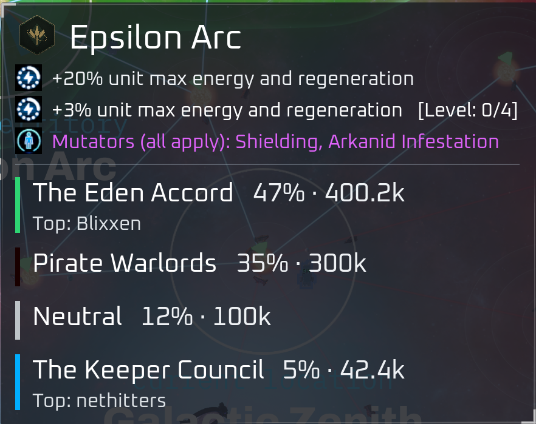
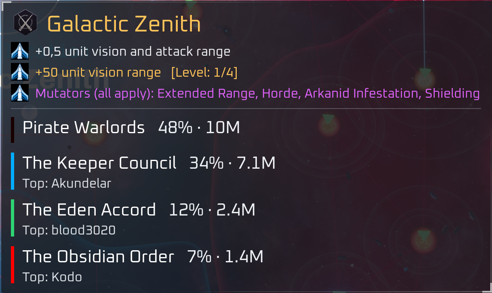
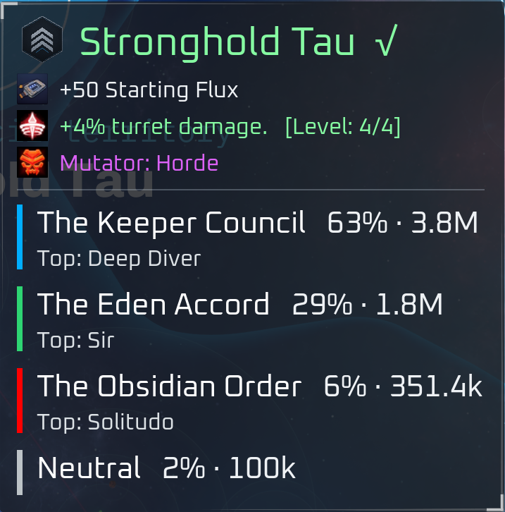

# Mastered Marker

Shows how far along a planet's mastery is on the galaxy map's hover tooltip, so you can read
it without clicking the planet.

## What changes on the tooltip

- The mastery line shows the planet's current rank as `[Level: N/4]`.
- The planet name and the mastery line are colored by that rank.
- A mark is added after the name once the planet is fully mastered.

| Rank | Planet name | Mastery line |
|---|---|---|
| 0 | white | white |
| 1 to 3 | orange | orange, with `[Level: N/4]` |
| 4 | green, with a mark | green, with `[Level: 4/4]` |

Rank 0, nothing started yet:



Rank 1 to 3, on the way:



Rank 4, fully mastered:



## Install

Download `zzzz_MasteredMarker_P.pak` from this folder, or build it yourself from the source
next to it (see [Building it yourself](#building-it-yourself)).

1. Close the game.
2. Copy `zzzz_MasteredMarker_P.pak` into
   `...\steamapps\common\ZeroSpace\Zerospace\Content\Paks`
3. Start the game, open Galactic War, and hover a planet.

## Uninstall

Delete the file.

## Compatibility

- Built for game build **24827478** (the 2026-08-20 patch).  
  A game update that changes the galaxy tooltip may require an updated version of this pak.
- Conflicts with any other mod that replaces the galaxy tooltip widget
  (`WBP_GalaxyPieTooltip`).
- Works whether you host or join.  
  Nothing is sent to the server, and it makes no difference to anyone else in your party.
- Standalone.  
  It has no settings, so it does not need the mod manager or any other mod.
- Newer than the other mods here, and its own pak, so you can delete it on its own if it
  misbehaves.

---

## Building it yourself

The patcher is C# on .NET 10 and uses [UAssetAPI](https://github.com/atenfyr/UAssetAPI), plus
`ZSPatchKit` from [`../lib`](../lib), so keep the two folders next to each other.

1. Pull `WBP_GalaxyPieTooltip.uasset` (and `.uexp`) out of your own game install with
   [FModel](https://fmodel.app) or anything else built on CUE4Parse.
2. Run the patcher:

   ```powershell
   dotnet run --project patcher -- <original WBP_GalaxyPieTooltip.uasset> <output folder>
   ```

3. Pack what it wrote with [repak](https://github.com/trumank/repak):

   ```powershell
   repak.exe pack --version V11 -m "../../../" <output folder> zzzz_MasteredMarker_P.pak
   ```
