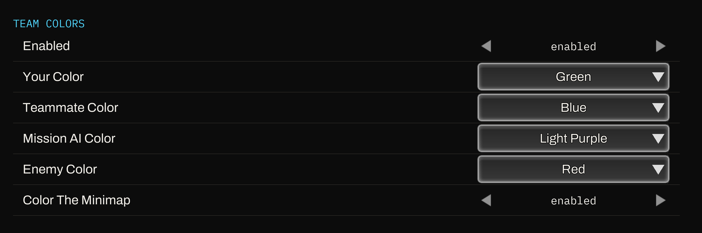

# Team Colors

Gives you full control over the colors of each player (and AI)

## What it changes

- **You, your teammate, mission AI allies and enemies each get their own color.**
  Pick between 19 colors for each player/AI. 
- Default:
  - You are green
  - Teammate is blue
  - Mission AI is light purple (Friendly mission AI, Metal March for example)
  - Enemies are red
- **A minimap toggle.** 
  - On: The minimap draws every unit in its owner's color.
  - Off: Game default, mismatching colors. 

The settings, in Settings -> Mods:



## Install

Download `zzzz_ZSTeamColors_P.pak` from this folder, or build it yourself from the source
next to it (see [Building it yourself](#building-it-yourself)).

1. Close the game.
2. Copy `zzzz_ZSTeamColors_P.pak` into
   `...\steamapps\common\ZeroSpace\Zerospace\Content\Paks`
3. Start the game and play a match.

## Uninstall

Delete the file.

## Compatibility

- Built for game build **24827478** (the 2026-08-20 patch).  
  A game update that changes the in-match HUD may require an updated version of this pak.
- Conflicts with any other mod that replaces the same HUD widget (`RTSSampleHUDWidget`).
- Options live in **Settings -> Mods**.  
  That page comes from the ZS Mod Manager pak.  
  Without the manager the mod still runs, on the defaults listed above.

---

## Building it yourself

The patcher is C# on .NET 10 and uses [UAssetAPI](https://github.com/atenfyr/UAssetAPI) to
edit the widget's compiled Blueprint bytecode.  
You need two things:

1. `RTSSampleHUDWidget.uasset` (and `.uexp`) **out of your own game install**.  
   Any CUE4Parse-based tool will do it, [FModel](https://fmodel.app) is the easy one.  
   The game's paks are UE 4.27 and not encrypted, so there is no key to find.
2. The patcher, pointed at that file:

```powershell
dotnet run --project patcher -- <original RTSSampleHUDWidget.uasset> <output folder>
```

It writes `<output folder>\Zerospace\Content\RTSGameSample\UI\`.  
Pack that with [repak](https://github.com/trumank/repak):

```powershell
repak.exe pack --version V11 -m "../../../" <output folder> zzzz_ZSTeamColors_P.pak
```

The patcher checks the layout facts it depends on before it changes anything, so a game
update that moves this code fails the build instead of producing a broken pak.
